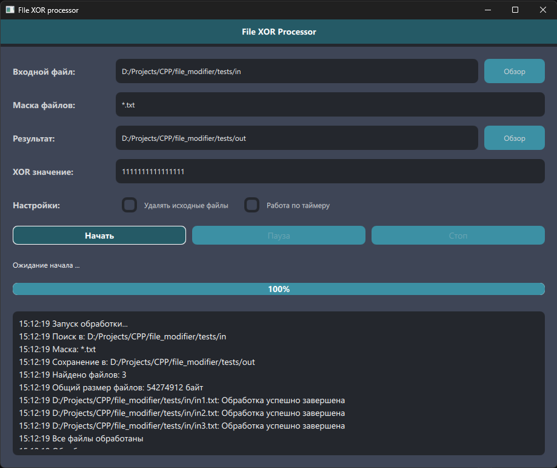

# File xor processor

**Модификатор входных файлы операцией XOR с 8-байтной переменной введенной с формы**

## Интерфейс


## Быстрый старт
```bash
git clone https://github.com/suaviludius/file_modifier.git
cd file_modifier
mkdir build && cd build
cmake ..
cmake --build . --config Release
./appfile_modifier
```

## Конфигурация (GUI)

| Параметр | Описание |
|----------|----------|
| `Путь поиска` | Папка с исходными файлами |
| `Маска файлов` | Например, `*.txt`, `*.bin` |
| `Путь сохранения` | Папка для результатов |
| `XOR значение` | 16 HEX символов (64 бита)|
| `Удалять исходные` | Да/Нет |
| `Режим работы` |Разовый/по таймеру|
| `Интервал (сек)` | Период сканирования (если таймер)|
| `Конфликт имён`* | Перезапись/счётчик|

**Конфликт имён - в данной версии выставляется в бекенде, а не GUI*

## Алгоритм работы
`GUI <-> Backend <-> Processor`
- **GUI** - ввод и валидация параметров (пути, маска, XOR)
- **Backend** - сканирование каталога, формирование очереди, управление паузой/стопом
- **Processor** - чтение блоками (1 МБ), XOR, запись, обновление прогресса
